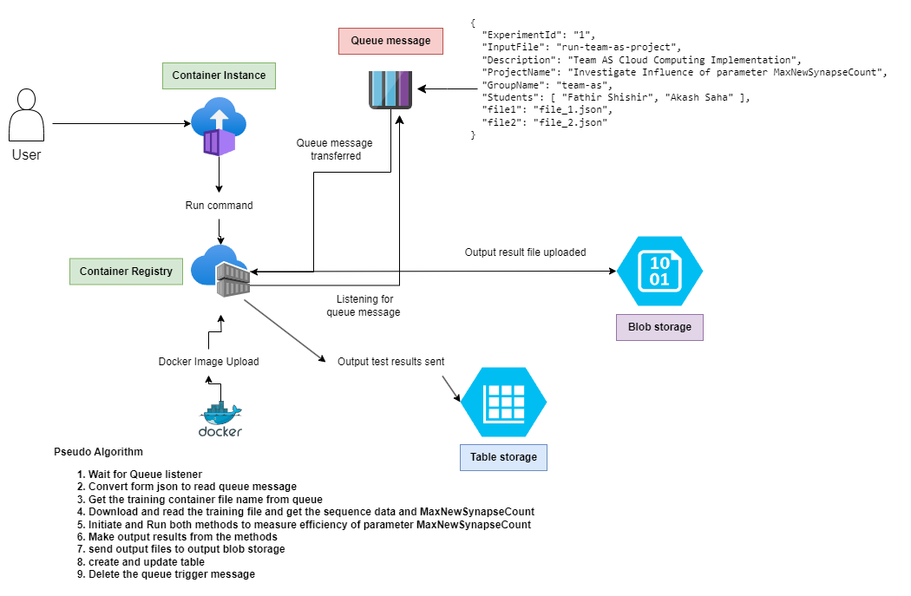
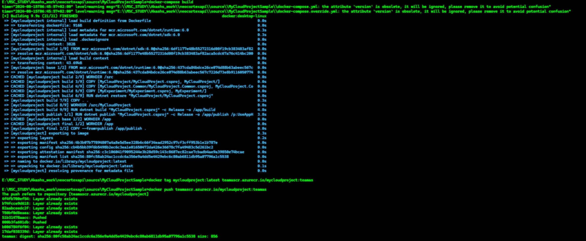
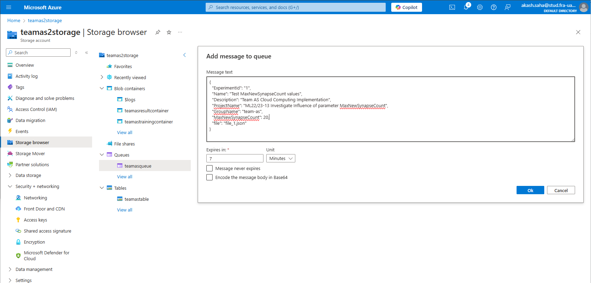
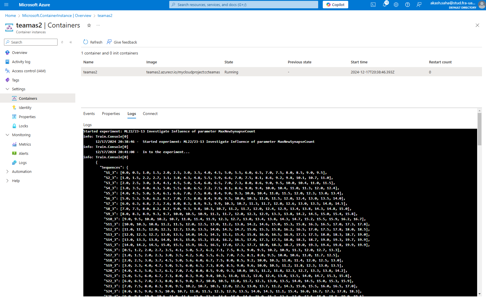
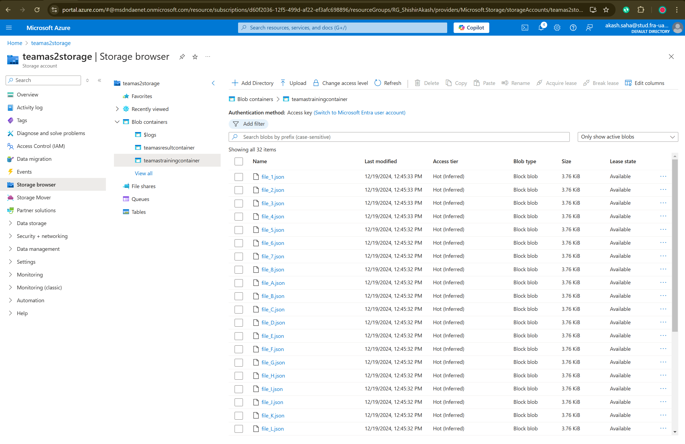
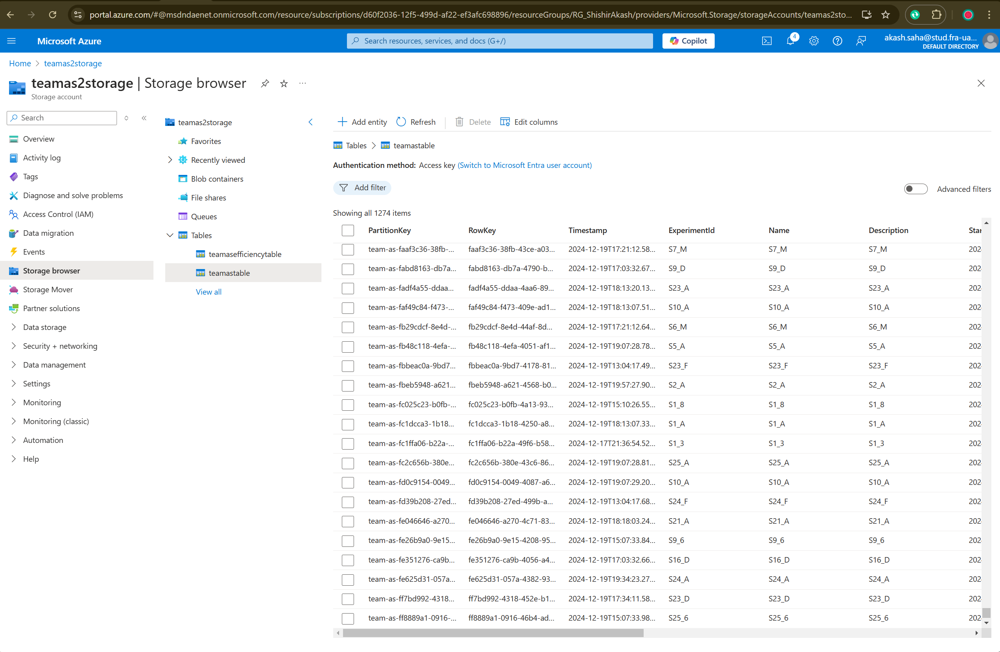
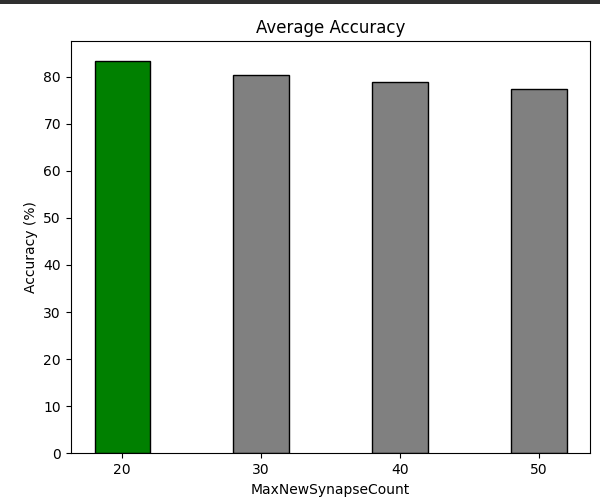
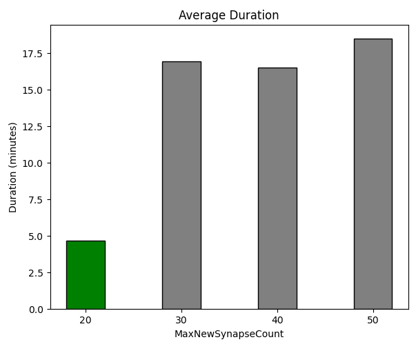
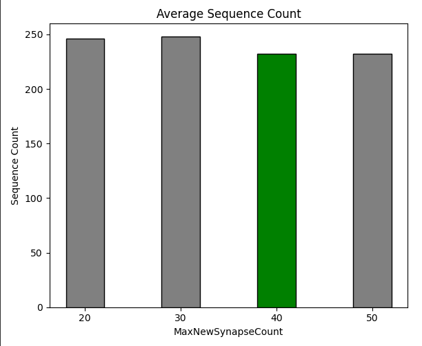
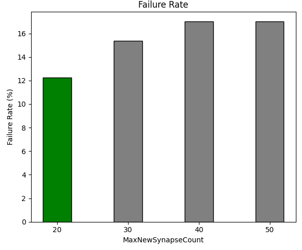

# ML22/23-13 Investigate Influence of parameter MaxNewSynapseCount - Azure Cloud Implementation
## Introduction
Temporal memory algorithms have gained popularity as a promising approach for modeling temporal sequences in machine learning. The objective of this project is to explore the effects of varying the MaxNewSynapseCount parameter within a temporal memory algorithm. This algorithm, inspired by the principles of cortical columns and the neocortex, plays a critical role in sequence learning and prediction by leveraging sparse distributed representations (SDR). Our goal is to analyze how different settings of this parameter influence the algorithm's accuracy and learning speed, particularly in complex, multi-sequence learning scenarios.

To enhance the reliability and scalability of our experiments, we are executing this project on the Azure Cloud. Running the analysis in a cloud environment offers several advantages over traditional local execution. Azure's scalable infrastructure allows us to process large datasets and execute computationally intensive tasks with greater efficiency. The cloud also facilitates seamless integration of various services, such as data storage, real-time monitoring, and automated deployments, which are crucial for handling extensive experimentation and data analysis.

Moreover, by leveraging Azure's distributed computing capabilities, we can parallelize our experiments, leading to faster iteration cycles and more comprehensive exploration of the parameter space. This approach not only improves the robustness of our findings but also ensures that our methodology can be easily scaled and adapted to future research initiatives.

In summary, implementing this project on Azure Cloud provides us with the computational power, flexibility, and scalability required to conduct a thorough investigation of the MaxNewSynapseCount parameter's impact, ultimately contributing to a deeper understanding of temporal memory algorithms in machine learning.

## Recap (Software Engineering Project)
If you need to obtain a copy of our project on your own system, use these links in order to carry out development and testing. Look at the notes on how to deploy the project and experiment with it on a live system. These are the relevant links:

- Project Documentation: [Documentation](https://github.com/Fathir-shishir/neocortexapi/blob/team_AS/source/MySEProject/EffectMaxNewSynapseCount/EffectMaxNewSynapseCount/Documentation/ML22_23-1%20Investigate%20Influence%20of%20parameter%20MaxNewSynapseCount-Team_AS.pdf) 

- Unit Test Cases: [here](https://github.com/Fathir-shishir/neocortexapi/tree/team_AS/source/MySEProject/EffectMaxNewSynapseCount/EffectMaxNewSynapseCount/EffectSynapseCountTest)

## What is this experiment about
In this experiment we have implemented our Software Engineering project in Azure cloud. Below is the total algorithm of the project:



## Information about our Azure accounts and their components

|  |  |  |
| --- | --- | --- |
| Resource Group | ```RG-teamAS``` | --- |
| Container Registry | ```teamascr``` | --- |
| Container Registry server | ```teamascr.azurecr.io``` | --- |
| Container Instance | ```teamas1``` | --- |
| Storage account | ```teamas2storage``` | --- |
| Queue storage | ```teamasqueue``` | Queue which containes trigger message |
| Training container | ```teamastrainingcontainer``` | Container used to store training data|
| Result container | ```teamasresultcontainer``` | Container used to store result data|
| Table storage | ```teamastable``` | Table used to store all output datas and results |
| Efficiency Table storage | ```efficiencytable``` | Table used to store all efficiency results |

The experiment Docker image can be pulled from the Azure Container Registry using the instructions below.
~~~
docker login teamas2.azurecr.io -u teamas2 -p 01Lf8cP8bucin7R4utc8aqq0tVoU3kUPVGRmf55exm+ACRCoUYHB
~~~
~~~
docker pull teamas2.azurecr.io/mycloudproject:ccteamas
~~~

then run 
~~~
docker-compose build
~~~ 

The docker image will be build



## How to run the experiment
## Step1 : Message input from azure portal
at a message to queues inside Azure storage account.
p.s Uncheck "Encode the message body in Base64"

**How to add message :** 

Azure portal > Home > RG-teamAS | Queues > teamasqueue> Add message


### Queue Message that will trigger the experiment:
~~~json
{
  "ExperimentId": "1",
  "Name": "Test MaxNewSynapseCount values",
  "Description": "Team AS Cloud Computing Implementation",
  "ProjectName": "ML22/23-13 Investigate Influence of parameter MaxNewSynapseCount",
  "GroupName": "team-as",
  "MaxNewSynapseCount": 20,
  "file": "file_1.json",
  "OperationType":  "no"
}
~~~

### Queue Message that will calculate the overall efficiency result:
~~~json
{
  "ExperimentId": "1",
  "Name": "Test MaxNewSynapseCount values",
  "Description": "Team AS Cloud Computing Implementation",
  "ProjectName": "ML22/23-13 Investigate Influence of parameter MaxNewSynapseCount",
  "GroupName": "team-as",
  "MaxNewSynapseCount": 20,
  "OperationType":  "efficiency"
}
~~~

In the above queue message we are passing the "OperationType" as "efficiency" to calculate the overall efficiency of all the "maxNewSynapseCount" values

Go to "teamas1," "Containers," and "logs" to make sure the experiment is being run from a container instance.

when the experiment  is successful bellow message(Experiment complete successfully) will be shown. Experiment successfully



## Step2: Describe the Experiment Training Input Container

Before the experiments are starting, the input files are stored in ``` teamastrainingcontainer``` 

After the queue message received, this files are read from the container and the project is started.



## Step3: Describe the Experiment Result Output Container

after the experiments are completed, the result file is stored in Azure storage blob containers 


the result data are also subsequently uploaded into a database table named "teamastable"



# Datasets Input Format:

This is how we save the dataset in a json file and upload in the blobstorage named training container and pass the file name as the value in queue message such as "file1": "file_1.json". We have created sample datasets like this which accumulates to over `1600` sequences and we have conducted experiments on them with different maxNewSynapseCount like 20, 30, 40 and 50.

```json
{
  "Sequences": {
    "S1_A": [0.0, 0.5, 1.1, 1.5, 2.0, 2.5, 3.0, 3.5, 4.0, 4.5, 5.0, 5.5, 6.0, 6.5, 7.0, 7.5, 8.0, 8.5, 9.0, 9.5],
    "S2_A": [1.1, 1.5, 2.2, 2.7, 3.1, 3.8, 4.3, 4.8, 5.5, 5.9, 6.6, 7.0, 7.5, 8.1, 8.6, 9.2, 9.8, 10.1, 10.7, 11.1],
    "S3_A": [2.0, 2.5, 3.0, 3.4, 4.1, 4.5, 5.0, 5.4, 6.0, 6.5, 7.0, 7.3, 8.0, 8.6, 9.0, 9.5, 10.0, 10.4, 11.1, 11.5],
    "S4_A": [3.0, 3.5, 4.0, 4.3, 5.0, 5.5, 6.0, 6.5, 7.2, 7.5, 8.1, 8.6, 9.0, 9.4, 10.0, 10.4, 11.1, 11.3, 12.0, 12.4],
    "S5_A": [4.0, 4.5, 5.0, 5.4, 6.1, 6.6, 7.0, 7.5, 8.0, 8.4, 9.0, 9.3, 10.0, 10.4, 11.1, 11.5, 12.0, 12.3, 13.0, 13.4],
    "S6_A": [5.0, 5.3, 5.8, 6.2, 6.1, 7.0, 7.5, 8.0, 8.4, 9.0, 9.5, 10.0, 10.3, 11.1, 11.5, 12.0, 12.4, 13.0, 13.5, 14.0],
    "S7_A": [6.0, 6.3, 6.8, 7.1, 7.6, 8.0, 8.3, 8.9, 9.3, 9.9, 10.3, 10.7, 11.3, 11.7, 12.0, 12.6, 13.0, 13.5, 14.0, 14.5],
    "S8_A": [7.0, 7.5, 8.0, 8.2, 8.7, 9.0, 9.3, 9.8, 10.3, 10.7, 11.2, 11.7, 12.0, 12.4, 12.9, 13.4, 13.8, 14.4, 14.8, 15.0],
    "S9_A": [8.0, 8.3, 8.9, 9.3, 9.7, 10.0, 10.5, 10.9, 11.3, 11.7, 12.0, 12.3, 12.9, 13.3, 13.8, 14.2, 14.5, 15.0, 15.4, 15.8],
    "S10_A": [9.0, 10.5, 10.0, 10.2, 10.3, 11.1, 11.4, 11.9, 12.3, 12.7, 13.0, 13.4, 13.8, 14.4, 14.7, 15.2, 15.5, 15.9, 16.2, 16.1],
    "S11_A": [10.0, 10.3, 10.8, 11.2, 11.5, 12.0, 12.5, 13.0, 11.2, 13.8, 14.2, 14.6, 15.0, 15.3, 15.8, 16.3, 16.5, 17.0, 17.3, 17.8],
    "S12_A": [11.1, 11.5, 12.0, 12.3, 12.7, 13.0, 13.5, 14.0, 14.4, 14.7, 15.0, 15.3, 15.8, 16.2, 16.5, 17.0, 17.5, 17.8, 18.0, 18.5],
    "S13_A": [12.0, 12.3, 12.7, 13.0, 13.5, 14.0, 14.4, 14.4, 15.1, 15.4, 15.8, 16.0, 16.5, 16.9, 17.3, 17.5, 18.0, 18.3, 18.7, 19.0],
    "S14_A": [13.0, 13.3, 13.8, 14.0, 14.5, 15.0, 15.3, 15.8, 16.2, 16.5, 17.0, 17.3, 17.5, 18.0, 18.3, 18.7, 19.0, 19.3, 19.7, 19.9],
    "S15_A": [14.0, 14.2, 14.5, 15.0, 15.5, 15.9, 16.3, 16.5, 17.0, 17.3, 17.7, 18.0, 18.3, 18.7, 19.0, 19.3, 19.6, 19.8, 19.9, 19.9],
    "S16_A": [0.5, 1.2, 2.0, 2.7, 3.5, 4.1, 5.0, 5.7, 6.2, 7.1, 7.5, 8.3, 9.0, 9.5, 10.2, 10.9, 11.3, 12.0, 12.7, 13.3],
    "S17_A": [1.1, 1.5, 2.0, 2.3, 3.0, 3.5, 4.2, 5.0, 5.5, 6.3, 7.0, 7.5, 8.1, 8.8, 9.5, 10.0, 10.6, 11.1, 11.7, 12.5],
    "S18_A": [2.0, 2.5, 3.0, 3.7, 4.5, 5.0, 5.6, 6.0, 6.1, 7.5, 8.0, 8.5, 9.2, 10.0, 10.3, 11.1, 11.4, 12.0, 12.5, 13.0],
    "S19_A": [3.0, 3.3, 4.0, 4.7, 5.0, 5.5, 6.0, 6.5, 7.3, 8.0, 8.5, 9.0, 9.6, 10.0, 10.5, 11.2, 11.8, 12.3, 13.0, 13.5],
    "S20_A": [4.0, 4.3, 5.0, 5.7, 6.3, 7.0, 7.4, 8.0, 8.5, 9.0, 9.3, 10.0, 10.5, 11.2, 11.8, 12.3, 12.7, 13.3, 13.8, 14.2],
    "S21_A": [5.0, 5.5, 6.0, 6.1, 7.3, 8.0, 8.3, 9.0, 9.8, 10.3, 11.1, 11.3, 12.0, 12.4, 13.0, 13.5, 14.0, 14.7, 15.3, 15.8],
    "S22_A": [6.0, 6.5, 7.0, 7.3, 8.0, 8.5, 9.0, 9.7, 10.0, 10.5, 11.1, 11.7, 12.3, 13.0, 13.5, 14.0, 14.5, 15.0, 15.3, 15.9],
    "S23_A": [7.0, 7.5, 8.0, 8.3, 9.0, 9.5, 10.2, 10.7, 10.3, 12.0, 12.3, 13.0, 13.7, 11.2, 14.4, 15.0, 15.5, 16.0, 16.5, 17.0],
    "S24_A": [8.0, 8.5, 9.0, 9.5, 10.0, 10.7, 11.1, 11.5, 12.3, 12.9, 13.5, 14.0, 14.4, 11.1, 15.4, 16.0, 16.1, 17.3, 17.8, 18.3],
    "S25_A": [9.0, 9.5, 10.0, 10.5, 11.1, 11.5, 12.0, 12.7, 13.5, 14.0, 14.5, 15.0, 15.7, 12.3, 17.0, 17.5, 18.0, 18.5, 19.0, 19.5]
  },
  "TestLists": [
    [0.0, 0.5, 1.1, 1.5, 2.0, 2.5, 3.0, 3.5, 4.0, 4.5],
    [1.1, 1.5, 2.3, 3.0, 3.7, 4.2, 5.0, 5.5, 6.0, 6.1],
    [2.0, 2.5, 3.0, 3.5, 4.0, 4.7, 5.0, 5.5, 6.3, 7.0],
    [3.0, 3.3, 4.0, 4.7, 5.3, 6.0, 6.5, 7.0, 7.5, 8.3],
    [4.0, 4.5, 5.0, 5.5, 6.3, 7.0, 7.5, 8.0, 8.5, 9.0],
    [5.0, 5.3, 6.0, 6.5, 7.3, 8.0, 8.5, 9.0, 9.7, 10.3],
    [6.0, 6.5, 7.0, 7.3, 8.0, 8.5, 9.3, 10.0, 10.5, 11.1],
    [7.0, 7.5, 8.0, 8.3, 9.0, 9.5, 10.0, 10.5, 11.1, 11.7],
    [8.0, 8.5, 9.0, 9.5, 10.0, 10.7, 11.3, 12.0, 12.5, 13.0],
    [9.0, 9.5, 10.0, 10.5, 11.3, 12.0, 12.5, 13.0, 13.5, 14.0]
  ],
  "MaxNewSynapseCount": 20
}
```

# Experiment Results: Cloud Environment

## Methodology and Detailed Dataset Analysis

### Methodology

We have made processes significantly efficient by using how sequences are processed but in parallel using Parallel.ForEach. Each sequence is handled independently with its own predictor to optimize computation. Error handling ensures that even if a sequence fails, the failure is logged without impacting other sequences. Parallelization significantly improves performance by utilizing multiple threads, allowing multiple sequences to be computed simultaneously.

```csharp
// Parallel execution for each sequence
Parallel.ForEach(sequences, sequence =>
{
    string sequenceKey = sequence.Key; // This will be used as CycleID
    Log($"Processing {sequenceKey}...");

    try
    {
        // Each sequence gets its own Predictor
        MultiSequenceLearning experiment = new MultiSequenceLearning(MaxNewSynapseCount);
        var predictor = experiment.Run(
            new Dictionary<string, List<double>> { { sequenceKey, sequence.Value } },
            out int cycleCount,
            out double accuracy,
            out TimeSpan duration,
            out string status
        );

        // Predict for test lists
        var testLists = GenerateTestLists(testList);
        foreach (var testList in testLists)
        {
            predictor.Reset();
            PredictNextElement(predictor, testList);
        }

        // Log results for this sequence
        lock (resultsLock)
        {
            localResults[sequenceKey] = (sequenceKey, cycleCount, accuracy, duration, status);
        }

        Log($"Finished processing {sequenceKey} with Cycle Count: {cycleCount}, Accuracy: {accuracy:F2}%, Duration: {duration}, Status: {status}.");
    }
    catch (Exception ex)
    {
        // In case of failure, log the result as failed
        lock (resultsLock)
        {
            localResults[sequenceKey] = (sequenceKey, 0, 0.0, TimeSpan.Zero, "Failed");
        }

        Log($"Error processing {sequenceKey}: {ex.Message}");
    }
});
```

The GenerateTestLists method prepares input data for prediction by converting lists of doubles into arrays. Arrays are often more efficient to process than lists in numerical computation tasks, especially in prediction algorithms. The transformation maintains data integrity while ensuring compatibility with the predictor. We pass the TestList data from our training container. Here is the [full code snippet with context](https://github.com/Fathir-shishir/neocortexapi/blob/b774717c6e3f1d36cc0c8fdfada63b880043ed65/source/MyCloudProjectSample/MyExperiment/SEProject/Program1.cs#L41). 

```csharp
/// <summary>
/// Processes and returns test lists for predictions based on the provided data.
/// </summary>
/// <param name="testLists">A list of test sequences (List<List<double>>) to be used for predictions.</param>
/// <returns>A list of test sequences converted to double arrays.</returns>
private static List<double[]> GenerateTestLists(List<List<double>> testLists)
{
    // Convert each List<double> from testLists into a double[] and return as a List<double[]>
    return testLists.Select(list => list.ToArray()).ToList();
}
```

We have created a seperate entity class to store the efficiency of the sequence results in order to dynamically calculate the results after the sequence runs are complete. Here is the [full context of the code](https://github.com/Fathir-shishir/neocortexapi/blob/b774717c6e3f1d36cc0c8fdfada63b880043ed65/source/MyCloudProjectSample/MyExperiment/SEProject/Program1.cs#L118).
```csharp
public class EfficiencyResult : ITableEntity, IEfficiencyResult
{
    public EfficiencyResult(string partitionKey, string rowKey)
    {
        this.PartitionKey = partitionKey;
        this.RowKey = rowKey;
    }

    public string PartitionKey { get; set; }
    public string RowKey { get; set; }
    public DateTimeOffset? Timestamp { get; set; }
    public ETag ETag { get; set; }
    public string ExperimentId { get; set; }
    public string Name { get; set; }
    public string Description { get; set; }
    public DateTime? StartTimeUtc { get; set; }
    public DateTime? EndTimeUtc { get; set; }
    public TimeSpan AverageDuration { get; set; }
    public float AverageSequenceCount { get; set; }
    public float FailureRate { get; set; }
    public double AverageAccuracy { get; set; }
    public int MaxNewSynapseCount { get; set; }
}
```

We have calculated statistical summaries for experiment results based on specific filtering criteria MaxNewSynapseCount. Metrics like average accuracy, duration, sequence count, and failure rates are computed, providing insights into experiment performance. These calculations are later uploaded for reporting and visualization purposes.

```csharp
var filter = $"MaxNewSynapseCount eq {request.MaxNewSynapseCount}";
var experimentResults = client.Query<TableEntity>(filter);

// Initialize accumulators
double totalAccuracy = 0;
double totalDuration = 0;
int totalSequences = 0;
int failedSequences = 0;
int totalExperimentCount = 0;

foreach (var entity in experimentResults)
{
    var accuracy = entity.GetInt32("Accuracy");
    var duration = XmlConvert.ToTimeSpan(entity.GetString("Duration"));
    var sequence = entity.GetInt32("sequence");
    var status = entity.GetString("status");

    Console.WriteLine($"Queried Entity - Accuracy: {accuracy}, Duration: {duration}, Sequences: {sequence}");

    totalExperimentCount++;
    if (status == "failed")
    {
        failedSequences++;
    }
    else
    {
        totalAccuracy += accuracy ?? 0.0;
        totalDuration += duration.TotalSeconds;
        totalSequences += sequence ?? 0;
    }
}

// Calculate averages
var averageAccuracy = totalAccuracy / totalExperimentCount;
var averageDuration = TimeSpan.FromSeconds(totalDuration / totalExperimentCount);
var failureRate = (float)failedSequences / totalExperimentCount * 100;
var averageSequenceCount = (float)totalSequences / totalExperimentCount;
```

We have calculated all the results after running over 2000 sequences and calculated 4 points of difference when running sequences with different maxNewSynapseCount. Tyhe data points are Average Accuracy, Average Duration, Average Sequence count to stabilise the learning, and Average failure rate.

#### Average Accuracy
Average Accuracy = Total Accuracy / Total Experiment Count

#### Average Duration
Average Duration = Total Duration / Total Experiment Count

#### Average Sequence Count
Average Sequence Count = Total Sequences / Total Experiment Count

#### Failure Rate
Failure Rate (%) = (Failed Sequences / Total Experiment Count) × 100

Below is the result table for the results of the data points we have calculated.

### Table 1: Average Accuracy
| MaxNewSynapseCount | Average Accuracy (%) |
|--------------------|-----------------------|
| 20                 | 83.36                 |
| 30                 | 80.41                 |
| 40                 | 78.85                 |
| 50                 | 77.45                 |


Figure: Bar chart with Best average accuracy

### Table 2: Average Duration
| MaxNewSynapseCount | Average Duration (minutes) |
|--------------------|----------------------------|
| 20                 | 4 min 41 s                 |
| 30                 | 16 min 58 s                |
| 40                 | 16 min 31 s                |
| 50                 | 18 min 31 s                |


Figure: Bar chart with Best average duration

### Table 3: Average Sequence Count
| MaxNewSynapseCount | Average Sequence Count |
|--------------------|-------------------------|
| 20                 | 246.34                  |
| 30                 | 247.77                  |
| 40                 | 231.98                  |
| 50                 | 231.98                  |


Figure: Bar chart with Best average sequence counts

### Table 4: Failure Rate
| MaxNewSynapseCount | Failure Rate (%) |
|--------------------|------------------|
| 20                 | 12.24           |
| 30                 | 15.36           |
| 40                 | 17.00           |
| 50                 | 17.00           |


Figure: Bar chart with worst failure rate

## Observations
#### Accuracy vs. MaxNewSynapseCount
Increasing the MaxNewSynapseCount reduces the accuracy slightly.
Best accuracy is achieved at 20 synapses with 83.36%.
Duration vs. MaxNewSynapseCount

#### Higher MaxNewSynapseCount increases processing time.
Duration rises from 4 min 41 s (20) to 18 min 31 s (50).
Sequence Count vs. MaxNewSynapseCount

The number of sequences processed decreases as MaxNewSynapseCount increases.

#### Failure Rate vs. MaxNewSynapseCount

Higher failure rates are observed for larger MaxNewSynapseCount, indicating diminishing returns.


### 4. Balancing Accuracy, Cycles to StabThere is a trade-off between accuracy, cilize, and Duration
ycles to stabilize, and duration. Lower `maxNewSynapseCount` values perform well on simpler datasets with high accuracy and reasonable stabilization times. On the other hand, higher values stabilize faster but often lead to lower accuracy in simpler datasets and longer durations.

## Conclusion
This analysis demonstrates the trade-offs between accuracy, runtime, and reliability when configuring MaxNewSynapseCount.
Lower values (e.g., 20) provide higher accuracy and faster performance but may be less adaptable to complex patterns.
Higher values (e.g., 50) offer robustness for larger datasets at the expense of increased computation time and slightly lower accuracy.
