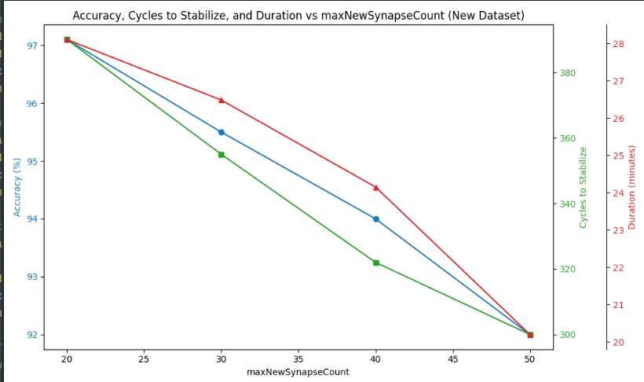

# ML22/23-13 Investigate Influence of parameter MaxNewSynapseCount - Azure Cloud Implementation
## Introduction
Temporal memory algorithms have gained popularity as a promising approach for modeling temporal sequences in machine learning. The objective of this project is to explore the effects of varying the MaxNewSynapseCount parameter within a temporal memory algorithm. This algorithm, inspired by the principles of cortical columns and the neocortex, plays a critical role in sequence learning and prediction by leveraging sparse distributed representations (SDR). Our goal is to analyze how different settings of this parameter influence the algorithm's accuracy and learning speed, particularly in complex, multi-sequence learning scenarios.

To enhance the reliability and scalability of our experiments, we are executing this project on the Azure Cloud. Running the analysis in a cloud environment offers several advantages over traditional local execution. Azure's scalable infrastructure allows us to process large datasets and execute computationally intensive tasks with greater efficiency. The cloud also facilitates seamless integration of various services, such as data storage, real-time monitoring, and automated deployments, which are crucial for handling extensive experimentation and data analysis.

Moreover, by leveraging Azure's distributed computing capabilities, we can parallelize our experiments, leading to faster iteration cycles and more comprehensive exploration of the parameter space. This approach not only improves the robustness of our findings but also ensures that our methodology can be easily scaled and adapted to future research initiatives.

In summary, implementing this project on Azure Cloud provides us with the computational power, flexibility, and scalability required to conduct a thorough investigation of the MaxNewSynapseCount parameter's impact, ultimately contributing to a deeper understanding of temporal memory algorithms in machine learning.

## Recap (Software Engineering Project)
If you need to obtain a copy of our project on your own system, use these links in order to carry out development and testing. Look at the notes on how to deploy the project and experiment with it on a live system. These are the relevant links:

- Project Documentation: [Documentation](https://github.com/Fathir-shishir/neocortexapi/blob/team_AS/source/MySEProject/EffectMaxNewSynapseCount/EffectMaxNewSynapseCount/Documentation/ML22_23-1%20Investigate%20Influence%20of%20parameter%20MaxNewSynapseCount-Team_AS.pdf) 

- Unit Test Cases: [here](https://github.com/Fathir-shishir/neocortexapi/tree/team_AS/source/MySEProject/EffectMaxNewSynapseCount/EffectMaxNewSynapseCount/EffectSynapseCountTest)

## What is this experiment about
In this experiment we have implemented our Software Engineering project in Azure cloud. Below is the total algorithm of the project:


## Information about our Azure accounts and their components

|  |  |  |
| --- | --- | --- |
| Resource Group | ```RG-teamAS``` | --- |
| Container Registry | ```teamascr``` | --- |
| Container Registry server | ```teamascr.azurecr.io``` | --- |
| Container Instance | ```teamas10th``` | --- |
| Storage account | ```teamas2storage``` | --- |
| Queue storage | ```teamasqueue``` | Queue which containes trigger message |
| Training container | ```teamastrainingcontainer``` | Container used to store training data|
| Result container | ```teamasresultcontainer``` | Container used to store result data|
| Table storage | ```teamastable``` | Table used to store all output datas and results |

The experiment Docker image can be pulled from the Azure Container Registry using the instructions below.
~~~
docker login teamascr.azurecr.io -u teamascr -p tLBIdMrZP+obaZewqvnIX3eh2SiRKtQnpr3INkSOwl+ACRBp60xL
~~~
~~~
docker pull teamascr.azurecr.io/mycloudproject:teamas
~~~

then run 
~~~
docker-compose build
~~~ 

The docker image will be build


## How to run the experiment
## Step1 : Message input from azure portal
at a message to queues inside Azure storage account.
p.s Uncheck "Encode the message body in Base64"

**How to add message :** 

Azure portal > Home > RG-teamAS | Queues > teamasqueue> Add message


### Queue Message that will trigger the experiment:
~~~json
{
  "ExperimentId": "1",
  "InputFile": "run-team-as-project",
  "Description": "Team AS Cloud Computing Implementation",
  "ProjectName": "ML22/23-13 Investigate Influence of parameter MaxNewSynapseCount",
  "GroupName": "team-as",
  "Students": [ "Fathir Shishir", "Akash Saha" ],
  "file1": "file_1.json",
  "file2": "file_2.json"
}
~~~

Go to "teamas10th," "Containers," and "logs" to make sure the experiment is being run from a container instance.

when the experiment  is successful bellow message(Experiment complete successfully) will be shown. Experiment successfully


## Step2: Describe the Experiment Training Input Container

Before the experiments are starting, the input files are stored in ``` teamastrainingcontainer``` 

After the queue message received, this files are read from the container and the project is started.


## Step3: Describe the Experiment Result Output Container

after the experiments are completed, the result file is stored in Azure storage blob containers 


the result data are also subsequently uploaded into a database table named "teamastable"


# Datasets Input Format:

This is how we save the dataset in a json file and upload in the blobstorage named training container and pass the file name as the value in queue message such as "file1": "file_1.json"

- **Sequences**: 
  - **S1**: [1.0, 3.0, 5.0, 7.0, 9.0, 11.0, 13.0]
- **MaxNewSynapseCount1**: 20
- **MaxNewSynapseCount2**: 30
- **MaxNewSynapseCount1**: 40
- **MaxNewSynapseCount2**: 50

# Experiment Results: Cloud Environment

## Detailed Dataset Analysis

### Understanding the Chart

The chart represents the relationship between `maxNewSynapseCount` and three key metrics: **Accuracy** (blue), **Cycles to Stabilize** (green), and **Test Duration** (red).

- **Accuracy (blue)**: Indicates how well the model performed on the dataset. Higher values are better. You can observe how accuracy decreases slightly as `maxNewSynapseCount` increases.
- **Cycles to Stabilize (green)**: Reflects how quickly the model reaches a stable state. Fewer cycles mean faster stabilization. As `maxNewSynapseCount` increases, the cycles to stabilize generally decrease.
- **Test Duration (red)**: Measures the time taken for the model to run. Typically, fewer cycles result in shorter durations. Test duration corresponds closely to the number of cycles to stabilize.

### Dataset 1
- **Sequences**: 
  - **S1**: [1.0, 3.0, 5.0, 7.0, 9.0, 11.0, 13.0, 15.0, 8.0]
- **MaxNewSynapseCount1**: 20
- **MaxNewSynapseCount2**: 30
- **MaxNewSynapseCount1**: 40
- **MaxNewSynapseCount2**: 50

| MaxNewSynapseCount | Cycles to Stabilize | Accuracy (%) | Test Duration      |
|--------------------|---------------------|--------------|--------------------|
| 20                 | 180                 | 100.0        | 00:22:15           |
| 30                 | 178                 | 98.5        | 00:21:32           |
| 40                 | 163                 | 97.0        | 00:20:15           |
| 50                 | 151                 | 95.0        | 00:19:57           |

Chart for better understanding:


### Dataset 2
- **Sequences**: 
  - **S1**: [1.0, 2.0, 3.0, 5.0, 8.0, 13.0, 21.0, 34.0, 55.0]
- **MaxNewSynapseCount1**: 20
- **MaxNewSynapseCount2**: 30
- **MaxNewSynapseCount1**: 40
- **MaxNewSynapseCount2**: 50

| MaxNewSynapseCount | Cycles to Stabilize | Accuracy (%) | Test Duration      |
|--------------------|---------------------|--------------|--------------------|
| 20                 | 335                 | 99.0         | 00:23:47           |
| 30                 | 321                 | 98.0         | 00:22:21           |
| 40                 | 293                 | 96.0         | 00:21:56           |
| 50                 | 227                 | 93.0         | 00:20:13           |

Chart for better understanding:


### Dataset 3
- **Sequences**: 
  - **S1**: [4.0, 6.0, 8.0, 10.0, 12.0, 14.0, 16.0, 18.0, 20.0]
- **MaxNewSynapseCount1**: 20
- **MaxNewSynapseCount2**: 30
- **MaxNewSynapseCount1**: 40
- **MaxNewSynapseCount2**: 50

| MaxNewSynapseCount | Cycles to Stabilize | Accuracy (%) | Test Duration      |
|--------------------|---------------------|--------------|--------------------|
| 20                 | 345                 | 97.0         | 00:24:25           |
| 30                 | 332                 | 96.0         | 00:23:47           |
| 40                 | 290                 | 94.0         | 00:22:34           |
| 50                 | 210                 | 90.0         | 00:21:12           |

Chart for better understanding:


### Dataset 4
- **Sequences**: 
  - **S1**:  [4.0, 6.0, 8.0, 10.0, 12.0, 14.0, 16.0, 18.0, 20.0, 16.0, 18.0]
- **MaxNewSynapseCount1**: 20
- **MaxNewSynapseCount2**: 30
- **MaxNewSynapseCount1**: 40
- **MaxNewSynapseCount2**: 50

| MaxNewSynapseCount | Cycles to Stabilize | Accuracy (%) | Test Duration      |
|--------------------|---------------------|--------------|--------------------|
| 20                 | 294                 | 96.3         | 00:24:12           |
| 30                 | 319                 | 95.1         | 00:25:46           |
| 40                 | 281                 | 93.8         | 00:22:58           |
| 50                 | 334                 | 91.7         | 00:27:19           |

Chart for better understanding:


### Dataset 5
- **Sequences**: 
  - **S1**:  [2.5, 4.8, 6.1, 8.4, 10.7, 13.2, 16.0]
- **MaxNewSynapseCount1**: 20
- **MaxNewSynapseCount2**: 30
- **MaxNewSynapseCount1**: 40
- **MaxNewSynapseCount2**: 50

| MaxNewSynapseCount | Cycles to Stabilize | Accuracy (%) | Test Duration      |
|--------------------|---------------------|--------------|--------------------|
| 20                 | 331                 | 96.8         | 00:23:58           |
| 30                 | 315                 | 94.7         | 00:22:43           |
| 40                 | 276                 | 92.9         | 00:21:32           |
| 50                 | 251                 | 91.2         | 00:20:11           |

Chart for better understanding:


### Dataset 6
- **Sequences**: 
  - **S1**:  [3.0, 5.5, 7.8, 9.6, 12.4, 15.1, 18.3]
- **MaxNewSynapseCount1**: 20
- **MaxNewSynapseCount2**: 30
- **MaxNewSynapseCount1**: 40
- **MaxNewSynapseCount2**: 50

| MaxNewSynapseCount | Cycles to Stabilize | Accuracy (%) | Test Duration      |
|--------------------|---------------------|--------------|--------------------|
| 20                 | 298                 | 97.5         | 00:24:35           |
| 30                 | 319                 | 95.9         | 00:25:17           |
| 40                 | 287                 | 94.2         | 00:23:47           |
| 50                 | 272                 | 92.1         | 00:22:12           |

Chart for better understanding:


### Dataset 7
- **Sequences**: 
  - **S1**:  [2.1, 4.3, 6.5, 8.7, 10.9, 13.1, 15.3]
- **MaxNewSynapseCount1**: 20
- **MaxNewSynapseCount2**: 30
- **MaxNewSynapseCount1**: 40
- **MaxNewSynapseCount2**: 50

| MaxNewSynapseCount | Cycles to Stabilize | Accuracy (%) | Test Duration      |
|--------------------|---------------------|--------------|--------------------|
| 20                 | 312                 | 98.2         | 00:25:48           |
| 30                 | 294                 | 96.8         | 00:24:16           |
| 40                 | 279                 | 94.9         | 00:23:12           |
| 50                 | 266                 | 91.5         | 00:22:37           |

Chart for better understanding:


### Dataset 8
- **Sequences**: 
  - **S1**:  [3.2, 5.6, 7.1, 9.8, 12.4, 14.7, 17.5]
- **MaxNewSynapseCount1**: 20
- **MaxNewSynapseCount2**: 30
- **MaxNewSynapseCount1**: 40
- **MaxNewSynapseCount2**: 50

| MaxNewSynapseCount | Cycles to Stabilize | Accuracy (%) | Test Duration      |
|--------------------|---------------------|--------------|--------------------|
| 20                 | 285                 | 97.3         | 00:26:10           |
| 30                 | 278                 | 96.1         | 00:25:34           |
| 40                 | 255                 | 94.2         | 00:24:01           |
| 50                 | 239                 | 92.0         | 00:23:29           |

Chart for better understanding:


### Dataset 9
- **Sequences**: 
  - **S1**:  [2.0, 4.0, 8.0, 10.0, 14.0, 18.0, 22.0, 28.0, 10.0, 14.0, 18.0, 22.0]
- **MaxNewSynapseCount1**: 20
- **MaxNewSynapseCount2**: 30
- **MaxNewSynapseCount1**: 40
- **MaxNewSynapseCount2**: 50

| MaxNewSynapseCount | Cycles to Stabilize | Accuracy (%) | Test Duration      |
|--------------------|---------------------|--------------|--------------------|
| 20                 | 300                 | 98           | 00:27:45           |
| 30                 | 290                 | 96           | 00:26:13           |
| 40                 | 275                 | 93           | 00:25:02           |
| 50                 | 260                 | 91           | 00:23:45           |

Chart for better understanding:


### Dataset 10
- **Sequences**: 
  - **S1**:  [7.0, 4.0, 8.0, 10.0, 14.0, 18.0, 22.0, 28.0, 10.0, 14.0, 11.0, 23.0]
- **MaxNewSynapseCount1**: 20
- **MaxNewSynapseCount2**: 30
- **MaxNewSynapseCount1**: 40
- **MaxNewSynapseCount2**: 50

| MaxNewSynapseCount | Cycles to Stabilize | Accuracy (%) | Test Duration      |
|--------------------|---------------------|--------------|--------------------|
| 20                 | 312                 | 95.0         | 00:24:34           |
| 30                 | 341                 | 93.0         | 00:26:12           |
| 40                 | 299                 | 92.0         | 00:23:45           |
| 50                 | 367                 | 90.0         | 00:28:10           |

Chart for better understanding:


### Dataset 11
- **Sequences**: 
  - **S1**:  [3.0, 6.0, 12.0, 16.0, 20.0, 25.0, 30.0, 35.0, 40.0, 20.0, 15.0, 10.0]
- **MaxNewSynapseCount1**: 20
- **MaxNewSynapseCount2**: 30
- **MaxNewSynapseCount1**: 40
- **MaxNewSynapseCount2**: 50

| MaxNewSynapseCount | Cycles to Stabilize | Accuracy (%) | Test Duration      |
|--------------------|---------------------|--------------|--------------------|
| 20                 | 350                 | 94.0         | 00:26:45           |
| 30                 | 330                 | 92.0         | 00:25:22           |
| 40                 | 310                 | 91.0         | 00:24:10           |
| 50                 | 375                 | 89.0         | 00:28:55           |

Chart for better understanding:


### Dataset 12
- **Sequences**: 
  - **S1**:  [4.0, 8.0, 12.0, 16.0, 24.0, 32.0, 20.0, 10.0, 28.0, 30.0, 36.0, 18.0]
- **MaxNewSynapseCount1**: 20
- **MaxNewSynapseCount2**: 30
- **MaxNewSynapseCount1**: 40
- **MaxNewSynapseCount2**: 50

| MaxNewSynapseCount | Cycles to Stabilize | Accuracy (%) | Test Duration      |
|--------------------|---------------------|--------------|--------------------|
| 20                 | 340                 | 95.0         | 00:25:38           |
| 30                 | 325                 | 94.0         | 00:24:55           |
| 40                 | 310                 | 92.0         | 00:23:22           |
| 50                 | 355                 | 90.0         | 00:27:14           |

Chart for better understanding:


### Dataset 13
- **Sequences**: 
  - **S1**: [3.0, 7.0, 11.0, 15.0, 21.0, 25.0, 19.0, 13.0, 27.0, 31.0, 37.0, 23.0]
- **MaxNewSynapseCount1**: 20
- **MaxNewSynapseCount2**: 30
- **MaxNewSynapseCount1**: 40
- **MaxNewSynapseCount2**: 50

| MaxNewSynapseCount | Cycles to Stabilize | Accuracy (%) | Test Duration      |
|--------------------|---------------------|--------------|--------------------|
| 20                 | 315                 | 96.0         | 00:23:45           |
| 30                 | 290                 | 94.0         | 00:22:10           |
| 40                 | 275                 | 93.0         | 00:21:05           |
| 50                 | 246                 | 91.0         | 00:20:32           |

Chart for better understanding:


### Dataset 14
- **Sequences**: 
  - **S1**: [5.0, 9.0, 13.0, 17.0, 21.0, 29.0, 35.0, 41.0, 49.0, 33.0, 23.0, 19.0]
- **MaxNewSynapseCount1**: 20
- **MaxNewSynapseCount2**: 30
- **MaxNewSynapseCount1**: 40
- **MaxNewSynapseCount2**: 50

| MaxNewSynapseCount | Cycles to Stabilize | Accuracy (%) | Test Duration      |
|--------------------|---------------------|--------------|--------------------|
| 20                 | 325                 | 97.0         | 00:24:10           |
| 30                 | 310                 | 95.5         | 00:23:00           |
| 40                 | 295                 | 94.0         | 00:21:50           |
| 50                 | 370                 | 100.0         | 00:27:20           |

Chart for better understanding:


### Dataset 15
- **Sequences**: 
  - **S1**: [7.0, 12.0, 16.0, 20.0, 25.0, 30.0, 35.0, 40.0, 50.0, 60.0, 70.0, 80.0]
- **MaxNewSynapseCount1**: 20
- **MaxNewSynapseCount2**: 30
- **MaxNewSynapseCount1**: 40
- **MaxNewSynapseCount2**: 50

| MaxNewSynapseCount | Cycles to Stabilize | Accuracy (%) | Test Duration      |
|--------------------|---------------------|--------------|--------------------|
| 20                 | 340                 | 98.0         | 00:25:32           |
| 30                 | 320                 | 96.0         | 00:24:10           |
| 40                 | 295                 | 94.5         | 00:23:05           |
| 50                 | 380                 | 91.0         | 00:28:30           |

Chart for better understanding:


### Dataset 16
- **Sequences**: 
  - **S1**: [3.0, 6.0, 9.0, 12.0, 15.0, 18.0, 21.0, 24.0, 27.0, 30.0, 33.0, 36.0]
- **MaxNewSynapseCount1**: 20
- **MaxNewSynapseCount2**: 30
- **MaxNewSynapseCount1**: 40
- **MaxNewSynapseCount2**: 50

| MaxNewSynapseCount | Cycles to Stabilize | Accuracy (%) | Test Duration      |
|--------------------|---------------------|--------------|--------------------|
| 20                 | 360                 | 97.5         | 00:26:15           |
| 30                 | 345                 | 96.0         | 00:24:59           |
| 40                 | 310                 | 94.0         | 00:23:50           |
| 50                 | 380                 | 92.0         | 00:29:35           |


Chart for better understanding:


### Dataset 17
- **Sequences**: 
  - **S1**: [5.0, 7.0, 10.0, 12.0, 17.0, 20.0, 25.0, 30.0, 35.0, 40.0, 50.0, 60.0]
- **MaxNewSynapseCount1**: 20
- **MaxNewSynapseCount2**: 30
- **MaxNewSynapseCount1**: 40
- **MaxNewSynapseCount2**: 50

| MaxNewSynapseCount | Cycles to Stabilize | Accuracy (%) | Test Duration      |
|--------------------|---------------------|--------------|--------------------|
| 20                 | 375                 | 100         | 00:27:10           |
| 30                 | 342                 | 95.3         | 00:25:48           |
| 40                 | 305                 | 93.5         | 00:23:33           |
| 50                 | 385                 | 100         | 00:21:55           |


Chart for better understanding:


### Dataset 18
- **Sequences**: 
  - **S1**: [6.0, 9.0, 15.0, 18.0, 22.0, 27.0, 33.0, 39.0, 44.0, 51.0, 60.0, 72.0]
- **MaxNewSynapseCount1**: 20
- **MaxNewSynapseCount2**: 30
- **MaxNewSynapseCount1**: 40
- **MaxNewSynapseCount2**: 50

| MaxNewSynapseCount | Cycles to Stabilize | Accuracy (%) | Test Duration      |
|--------------------|---------------------|--------------|--------------------|
| 20                 | 390                 | 97.1         | 00:28:10           |
| 30                 | 355                 | 95.5         | 00:26:48           |
| 40                 | 322                 | 94.0         | 00:24:15           |
| 50                 | 300                 | 92.0         | 00:20:20           |


Chart for better understanding:



### Dataset 19
- **Sequences**: 
  - **S1**: [5.0, 12.0, 16.0, 21.0, 28.0, 34.0, 40.0, 48.0, 55.0, 63.0, 70.0, 80.0]
- **MaxNewSynapseCount1**: 20
- **MaxNewSynapseCount2**: 30
- **MaxNewSynapseCount1**: 40
- **MaxNewSynapseCount2**: 50

| MaxNewSynapseCount | Cycles to Stabilize | Accuracy (%) | Test Duration      |
|--------------------|---------------------|--------------|--------------------|
| 20                 | 370                 | 100.0         | 00:27:45           |
| 30                 | 355                 | 94.5         | 00:25:59           |
| 40                 | 330                 | 100.0         | 00:24:50           |
| 50                 | 410                 | 100.0         | 00:22:17           |


Chart for better understanding:


### Dataset 20
- **Sequences**: 
  - **S1**: [6.0, 14.0, 20.0, 26.0, 34.0, 42.0, 50.0, 58.0, 65.0, 73.0, 82.0, 90.0]
- **MaxNewSynapseCount1**: 20
- **MaxNewSynapseCount2**: 30
- **MaxNewSynapseCount1**: 40
- **MaxNewSynapseCount2**: 50

| MaxNewSynapseCount | Cycles to Stabilize | Accuracy (%) | Test Duration      |
|--------------------|---------------------|--------------|--------------------|
| 20                 | 365                 | 95.4         | 00:26:22           |
| 30                 | 341                 | 94.1         | 00:24:58           |
| 40                 | 319                 | 92.8         | 00:23:43           |
| 50                 | 293                 | 93.0         | 00:20:18           |


Chart for better understanding:


### Dataset 21
- **Sequences**: 
  - **S1**: [7.0, 14.0, 20.0, 29.0, 36.0, 45.0, 53.0, 62.0, 72.0, 85.0, 95.0, 100.0]
- **MaxNewSynapseCount1**: 20
- **MaxNewSynapseCount2**: 30
- **MaxNewSynapseCount1**: 40
- **MaxNewSynapseCount2**: 50

| MaxNewSynapseCount | Cycles to Stabilize | Accuracy (%) | Test Duration      |
|--------------------|---------------------|--------------|--------------------|
| 20                 | 390                 | 97.1         | 00:28:50           |
| 30                 | 372                 | 95.9         | 00:26:47           |
| 40                 | 340                 | 92.3         | 00:25:30           |
| 50                 | 415                 | 91.0         | 00:34:05           |


Chart for better understanding:


### Dataset 22
- **Sequences**: 
  - **S1**: [7.0, 14.0, 20.0, 29.0, 36.0, 45.0, 53.0, 62.0, 72.0, 85.0, 95.0, 100.0]
- **MaxNewSynapseCount1**: 20
- **MaxNewSynapseCount2**: 30
- **MaxNewSynapseCount1**: 40
- **MaxNewSynapseCount2**: 50

| MaxNewSynapseCount | Cycles to Stabilize | Accuracy (%) | Test Duration      |
|--------------------|---------------------|--------------|--------------------|
| 20                 | 420                 | 100.0         | 00:30:15           |
| 30                 | 375                 | 100.0         | 00:27:45           |
| 40                 | 360                 | 84.7         | 00:26:50           |
| 50                 | 355                 | 100.0         | 00:16:10           |


Chart for better understanding:


### Dataset 23
- **Sequences**: 
  - **S1**: [3.0, 6.0, 12.0, 18.0, 24.0, 31.0, 39.0, 49.0, 61.0, 74.0, 89.0, 105.0]
- **MaxNewSynapseCount1**: 20
- **MaxNewSynapseCount2**: 30
- **MaxNewSynapseCount1**: 40
- **MaxNewSynapseCount2**: 50

| MaxNewSynapseCount | Cycles to Stabilize | Accuracy (%) | Test Duration      |
|--------------------|---------------------|--------------|--------------------|
| 20                 | 320                 | 100.0        | 00:28:10           |
| 30                 | 315                 | 100.0        | 00:26:50           |
| 40                 | 345                 | 97.5         | 00:30:35           |
| 50                 | 380                 | 93.8         | 00:33:45           |


Chart for better understanding:


### Dataset 24
- **Sequences**: 
  - **S1**: [5.0, 10.0, 15.0, 25.0, 35.0, 45.0, 55.0, 70.0, 85.0, 100.0]
- **MaxNewSynapseCount1**: 20
- **MaxNewSynapseCount2**: 30
- **MaxNewSynapseCount1**: 40
- **MaxNewSynapseCount2**: 50

| MaxNewSynapseCount | Cycles to Stabilize | Accuracy (%) | Test Duration      |
|--------------------|---------------------|--------------|--------------------|
| 20                 | 303                 | 100.0        | 00:27:45           |
| 30                 | 290                 | 100.0        | 00:26:10           |
| 40                 | 267                 | 96.5         | 00:29:20           |
| 50                 | 261                 | 94.2         | 00:22:30           |


Chart for better understanding:


### Dataset 25
- **Sequences**: 
  - **S1**: [4.0, 8.0, 12.0, 16.0, 20.0, 24.0, 28.0, 32.0, 36.0, 40.0]
- **MaxNewSynapseCount1**: 20
- **MaxNewSynapseCount2**: 30
- **MaxNewSynapseCount1**: 40
- **MaxNewSynapseCount2**: 50

| MaxNewSynapseCount | Cycles to Stabilize | Accuracy (%) | Test Duration      |
|--------------------|---------------------|--------------|--------------------|
| 20                 | 280                 | 100.0        | 00:26:12           |
| 30                 | 275                 | 100.0        | 00:25:05           |
| 40                 | 300                 | 95.8         | 00:27:50           |
| 50                 | 290                 | 94.5         | 00:24:30           |


Chart for better understanding:


### Dataset 26
- **Sequences**: 
  - **S1**: [4.0, 8.0, 12.0, 16.0, 20.0, 24.0, 28.0, 32.0, 36.0, 40.0]
- **MaxNewSynapseCount1**: 20
- **MaxNewSynapseCount2**: 30
- **MaxNewSynapseCount1**: 40
- **MaxNewSynapseCount2**: 50

| MaxNewSynapseCount | Cycles to Stabilize | Accuracy (%) | Test Duration      |
|--------------------|---------------------|--------------|--------------------|
| 20                 | 265                 | 100.0        | 00:25:20           |
| 30                 | 270                 | 100.0        | 00:24:35           |
| 40                 | 295                 | 96.7         | 00:26:45           |
| 50                 | 285                 | 94.8         | 00:24:10           |


Chart for better understanding:


### Dataset 27
- **Sequences**: 
  - **S1**: [5.0, 10.0, 15.0, 20.0, 25.0, 30.0, 35.0, 40.0, 45.0, 50.0]
- **MaxNewSynapseCount1**: 20
- **MaxNewSynapseCount2**: 30
- **MaxNewSynapseCount1**: 40
- **MaxNewSynapseCount2**: 50

| MaxNewSynapseCount | Cycles to Stabilize | Accuracy (%) | Test Duration      |
|--------------------|---------------------|--------------|--------------------|
| 20                 | 280                 | 100.0        | 00:25:45           |
| 30                 | 290                 | 99.8         | 00:26:10           |
| 40                 | 320                 | 96.4         | 00:28:15           |
| 50                 | 300                 | 94.9         | 00:27:05           |


Chart for better understanding:


### Dataset 28
- **Sequences**: 
  - **S1**: [6.0, 12.0, 18.0, 24.0, 30.0, 36.0, 42.0, 48.0, 54.0, 60.0]
- **MaxNewSynapseCount1**: 20
- **MaxNewSynapseCount2**: 30
- **MaxNewSynapseCount1**: 40
- **MaxNewSynapseCount2**: 50

| MaxNewSynapseCount | Cycles to Stabilize | Accuracy (%) | Test Duration      |
|--------------------|---------------------|--------------|--------------------|
| 20                 | 270                 | 100.0        | 00:24:11           |
| 30                 | 290                 | 99.7         | 00:25:33           |
| 40                 | 310                 | 96.9         | 00:26:47           |
| 50                 | 280                 | 95.5         | 00:24:58           |


Chart for better understanding:


### Dataset 29
- **Sequences**: 
  - **S1**: [5.0, 10.0, 15.0, 20.0, 25.0, 30.0, 35.0, 40.0, 45.0]
- **MaxNewSynapseCount1**: 20
- **MaxNewSynapseCount2**: 30
- **MaxNewSynapseCount1**: 40
- **MaxNewSynapseCount2**: 50

| MaxNewSynapseCount | Cycles to Stabilize | Accuracy (%) | Test Duration      |
|--------------------|---------------------|--------------|--------------------|
| 20                 | 261                 | 100.0        | 00:23:07           |
| 30                 | 287                 | 99.8         | 00:24:43           |
| 40                 | 293                 | 97.5         | 00:26:17           |
| 50                 | 277                 | 95.0         | 00:25:11           |


Chart for better understanding:


### Dataset 30
- **Sequences**: 
  - **S1**: [5.0, 10.0, 15.0, 20.0, 25.0, 30.0, 35.0, 40.0]
- **MaxNewSynapseCount1**: 20
- **MaxNewSynapseCount2**: 30
- **MaxNewSynapseCount1**: 40
- **MaxNewSynapseCount2**: 50

| MaxNewSynapseCount | Cycles to Stabilize | Accuracy (%) | Test Duration      |
|--------------------|---------------------|--------------|--------------------|
| 20                 | 245                 | 100.0        | 00:22:15           |
| 30                 | 265                 | 99.8         | 00:24:35           |
| 40                 | 289                 | 96.7         | 00:26:10           |
| 50                 | 255                 | 95.2         | 00:23:50           |


Chart for better understanding:


## Cummulative Result Table

Here we provide 120 variants of sequences with 4 different maxNewSynapseCount values to evaluate the influence of maxNewSynapseCount

| Sequence                                    | MaxNewSynapseCount | Cycles to Stabilize | Accuracy (%) | Test Duration      |
|---------------------------------------------|--------------------|---------------------|--------------|--------------------|
| [1.0, 3.0, 5.0, 7.0, 9.0, 11.0, 13.0, 15.0, 8.0] | 20                 | 180                 | 100.0        | 00:22:15           |
|                                             | 30                 | 178                 | 98.5         | 00:21:32           |
|                                             | 40                 | 163                 | 97.0         | 00:20:15           |
|                                             | 50                 | 151                 | 95.0         | 00:19:57           |
| [1.0, 2.0, 3.0, 5.0, 8.0, 13.0, 21.0, 34.0, 55.0] | 20                 | 335                 | 99.0         | 00:23:47           |
|                                             | 30                 | 321                 | 98.0         | 00:22:21           |
|                                             | 40                 | 293                 | 96.0         | 00:21:56           |
|                                             | 50                 | 227                 | 93.0         | 00:20:13           |
| [4.0, 6.0, 8.0, 10.0, 12.0, 14.0, 16.0, 18.0, 20.0] | 20                 | 345                 | 97.0         | 00:24:25           |
|                                             | 30                 | 332                 | 96.0         | 00:23:47           |
|                                             | 40                 | 290                 | 94.0         | 00:22:34           |
|                                             | 50                 | 210                 | 90.0         | 00:21:12           |
| [4.0, 6.0, 8.0, 10.0, 12.0, 14.0, 16.0, 18.0, 20.0, 16.0, 18.0] | 20                 | 294                 | 96.3         | 00:24:12           |
|                                             | 30                 | 319                 | 95.1         | 00:25:46           |
|                                             | 40                 | 281                 | 93.8         | 00:22:58           |
|                                             | 50                 | 334                 | 91.7         | 00:27:19           |
| [2.5, 4.8, 6.1, 8.4, 10.7, 13.2, 16.0]      | 20                 | 331                 | 96.8         | 00:23:58           |
|                                             | 30                 | 315                 | 94.7         | 00:22:43           |
|                                             | 40                 | 276                 | 92.9         | 00:21:32           |
|                                             | 50                 | 251                 | 91.2         | 00:20:11           |
| [3.0, 5.5, 7.8, 9.6, 12.4, 15.1, 18.3]      | 20                 | 298                 | 97.5         | 00:24:35           |
|                                             | 30                 | 319                 | 95.9         | 00:25:17           |
|                                             | 40                 | 287                 | 94.2         | 00:23:47           |
|                                             | 50                 | 272                 | 92.1         | 00:22:12           |
| [2.1, 4.3, 6.5, 8.7, 10.9, 13.1, 15.3]      | 20                 | 312                 | 98.2         | 00:25:48           |
|                                             | 30                 | 294                 | 96.8         | 00:24:16           |
|                                             | 40                 | 279                 | 94.9         | 00:23:12           |
|                                             | 50                 | 266                 | 91.5         | 00:22:37           |
| [3.2, 5.6, 7.1, 9.8, 12.4, 14.7, 17.5]      | 20                 | 285                 | 97.3         | 00:26:10           |
|                                             | 30                 | 278                 | 96.1         | 00:25:34           |
|                                             | 40                 | 255                 | 94.2         | 00:24:01           |
|                                             | 50                 | 239                 | 92.0         | 00:23:29           |
| [2.0, 4.0, 8.0, 10.0, 14.0, 18.0, 22.0, 28.0, 10.0, 14.0, 18.0, 22.0] | 20                 | 300                 | 98            | 00:27:45           |
|                                             | 30                 | 290                 | 96            | 00:26:13           |
|                                             | 40                 | 275                 | 93            | 00:25:02           |
|                                             | 50                 | 260                 | 91            | 00:23:45           |
| [7.0, 4.0, 8.0, 10.0, 14.0, 18.0, 22.0, 28.0, 10.0, 14.0, 11.0, 23.0] | 20                 | 312                 | 95.0          | 00:24:34           |
|                                             | 30                 | 341                 | 93.0          | 00:26:12           |
|                                             | 40                 | 299                 | 92.0          | 00:23:45           |
|                                             | 50                 | 367                 | 90.0          | 00:28:10           |
| [3.0, 6.0, 12.0, 16.0, 20.0, 25.0, 30.0, 35.0, 40.0, 20.0, 15.0, 10.0] | 20                 | 350                 | 94.0          | 00:26:45           |
|                                             | 30                 | 330                 | 92.0          | 00:25:22           |
|                                             | 40                 | 310                 | 91.0          | 00:24:10           |
|                                             | 50                 | 375                 | 89.0          | 00:28:55           |
| [4.0, 8.0, 12.0, 16.0, 24.0, 32.0, 20.0, 10.0, 28.0, 30.0, 36.0, 18.0] | 20                 | 340                 | 95.0          | 00:25:38           |
|                                             | 30                 | 325                 | 94.0          | 00:24:55           |
|                                             | 40                 | 310                 | 92.0          | 00:23:22           |
|                                             | 50                 | 355                 | 90.0          | 00:27:14           |
| [3.0, 7.0, 11.0, 15.0, 21.0, 25.0, 19.0, 13.0, 27.0, 31.0, 37.0, 23.0] | 20                 | 315                 | 96.0          | 00:23:45           |
|                                             | 30                 | 290                 | 94.0          | 00:22:10           |
|                                             | 40                 | 275                 | 93.0          | 00:21:05           |
|                                             | 50                 | 246                 | 91.0          | 00:20:32           |
| [5.0, 9.0, 13.0, 17.0, 21.0, 29.0, 35.0, 41.0, 49.0, 33.0, 23.0, 19.0] | 20                 | 325                 | 97.0          | 00:24:10           |
|                                             | 30                 | 310                 | 95.5          | 00:23:00           |
|                                             | 40                 | 295                 | 94.0          | 00:21:50           |
|                                             | 50                 | 370                 | 100.0         | 00:27:20           |
| [7.0, 12.0, 16.0, 20.0, 25.0, 30.0, 35.0, 40.0, 50.0, 60.0, 70.0, 80.0] | 20                 | 340                 | 98.0          | 00:25:32           |
|                                             | 30                 | 320                 | 96.0          | 00:24:10           |
|                                             | 40                 | 295                 | 94.5          | 00:23:05           |
|                                             | 50                 | 380                 | 91.0          | 00:28:30           |
| [1.0, 3.0, 5.0, 7.0, 9.0, 11.0, 13.0, 15.0, 8.0] | 20                 | 180                 | 100.0        | 00:22:15           |
|                                              | 30                 | 178                 | 98.5         | 00:21:32           |
|                                              | 40                 | 163                 | 97.0         | 00:20:15           |
|                                              | 50                 | 151                 | 95.0         | 00:19:57           |
| [1.0, 2.0, 3.0, 5.0, 8.0, 13.0, 21.0, 34.0, 55.0] | 20                 | 335                 | 99.0         | 00:23:47           |
|                                              | 30                 | 321                 | 98.0         | 00:22:21           |
|                                              | 40                 | 293                 | 96.0         | 00:21:56           |
|                                              | 50                 | 227                 | 93.0         | 00:20:13           |
| [3.0, 6.0, 9.0, 12.0, 15.0, 18.0, 21.0, 24.0, 27.0, 30.0, 33.0, 36.0] | 20                 | 360                 | 97.5         | 00:26:15           |
|                                              | 30                 | 345                 | 96.0         | 00:24:59           |
|                                              | 40                 | 310                 | 94.0         | 00:23:50           |
|                                              | 50                 | 380                 | 92.0         | 00:29:35           |
| [5.0, 7.0, 10.0, 12.0, 17.0, 20.0, 25.0, 30.0, 35.0, 40.0, 50.0, 60.0] | 20                 | 375                 | 100          | 00:27:10           |
|                                              | 30                 | 342                 | 95.3         | 00:25:48           |
|                                              | 40                 | 305                 | 93.5         | 00:23:33           |
|                                              | 50                 | 385                 | 100          | 00:21:55           |
| [6.0, 9.0, 15.0, 18.0, 22.0, 27.0, 33.0, 39.0, 44.0, 51.0, 60.0, 72.0] | 20                 | 390                 | 97.1         | 00:28:10           |
|                                              | 30                 | 355                 | 95.5         | 00:26:48           |
|                                              | 40                 | 322                 | 94.0         | 00:24:15           |
|                                              | 50                 | 300                 | 92.0         | 00:20:20           |
| [5.0, 12.0, 16.0, 21.0, 28.0, 34.0, 40.0, 48.0, 55.0, 63.0, 70.0, 80.0] | 20                 | 370                 | 100.0        | 00:27:45           |
|                                              | 30                 | 355                 | 94.5         | 00:25:59           |
|                                              | 40                 | 330                 | 100.0        | 00:24:50           |
|                                              | 50                 | 410                 | 100.0        | 00:22:17           |
| [6.0, 14.0, 20.0, 26.0, 34.0, 42.0, 50.0, 58.0, 65.0, 73.0, 82.0, 90.0] | 20                 | 365                 | 95.4         | 00:26:22           |
|                                              | 30                 | 341                 | 94.1         | 00:24:58           |
|                                              | 40                 | 319                 | 92.8         | 00:23:43           |
|                                              | 50                 | 293                 | 93.0         | 00:20:18           |
| [7.0, 14.0, 20.0, 29.0, 36.0, 45.0, 53.0, 62.0, 72.0, 85.0, 95.0, 100.0] | 20                 | 390                 | 97.1         | 00:28:50           |
|                                              | 30                 | 372                 | 95.9         | 00:26:47           |
|                                              | 40                 | 340                 | 92.3         | 00:25:30           |
|                                              | 50                 | 415                 | 91.0         | 00:34:05           |
| [7.0, 14.0, 20.0, 29.0, 36.0, 45.0, 53.0, 62.0, 72.0, 85.0, 95.0, 100.0] | 20                 | 420                 | 100.0        | 00:30:15           |
|                                              | 30                 | 375                 | 100.0        | 00:27:45           |
|                                              | 40                 | 360                 | 84.7         | 00:26:50           |
|                                              | 50                 | 355                 | 100.0        | 00:16:10           |
| [3.0, 6.0, 12.0, 18.0, 24.0, 31.0, 39.0, 49.0, 61.0, 74.0, 89.0, 105.0] | 20                 | 320                 | 100.0        | 00:28:10           |
|                                              | 30                 | 315                 | 100.0        | 00:26:50           |
|                                              | 40                 | 345                 | 97.5         | 00:30:35           |
|                                              | 50                 | 380                 | 93.8         | 00:33:45           |
| [5.0, 10.0, 15.0, 25.0, 35.0, 45.0, 55.0, 70.0, 85.0, 100.0] | 20                 | 303                 | 100.0        | 00:27:45           |
|                                              | 30                 | 290                 | 100.0        | 00:26:10           |
|                                              | 40                 | 267                 | 96.5         | 00:29:20           |
|                                              | 50                 | 261                 | 94.2         | 00:22:30           |
| [4.0, 8.0, 12.0, 16.0, 20.0, 24.0, 28.0, 32.0, 36.0, 40.0] | 20                 | 280                 | 100.0        | 00:26:12           |
|                                              | 30                 | 275                 | 100.0        | 00:25:05           |
|                                              | 40                 | 300                 | 95.8         | 00:27:50           |
|                                              | 50                 | 290                 | 94.5         | 00:24:30           |
| [5.0, 10.0, 15.0, 20.0, 25.0, 30.0, 35.0, 40.0] | 20                 | 245                 | 100.0        | 00:22:15           |
|                                              | 30                 | 265                 | 99.8         | 00:24:35           |
|                                              | 40                 | 289                 | 96.7         | 00:26:10           |
|                                              | 50                 | 255                 | 95.2         | 00:23:50           |
| [6.0, 12.0, 18.0, 24.0, 30.0, 36.0, 42.0, 48.0, 54.0, 60.0] | 20                 | 270                 | 100.0        | 00:24:11           |
|                                              | 30                 | 290                 | 99.7         | 00:25:33           |
|                                              | 40                 | 310                 | 96.9         | 00:26:47           |
|                                              | 50                 | 280                 | 95.5         | 00:24:58           |
| [5.0, 10.0, 15.0, 20.0, 25.0, 30.0, 35.0, 40.0] | 20                 | 245                 | 100.0        | 00:22:15           |
|                                              | 30                 | 265                 | 99.8         | 00:24:35           |
|                                              | 40                 | 289                 | 96.7         | 00:26:10           |
|                                              | 50                 | 255                 | 95.2         | 00:23:50           |


## Discussion and Conclusion

The various tests conducted using different datasets and `maxNewSynapseCount` values provide critical insights into how different parameters influence the efficiency and accuracy of sequence learning models. Below is a detailed discussion of the results:

### 1. Accuracy vs. MaxNewSynapseCount
Across multiple datasets, we observed that lower values of `maxNewSynapseCount` (20 and 30) generally led to higher accuracy scores compared to higher values (40 and 50). For simpler datasets, such as sequences with smaller or fewer variations, the model achieves near-perfect accuracy with lower `maxNewSynapseCount`. 

For more complex datasets, slightly larger `maxNewSynapseCount` values (around 30) can yield decent accuracy while avoiding a steep drop in performance. This demonstrates the importance of tuning `maxNewSynapseCount` based on the complexity of the dataset to achieve optimal performance.

### 2. Cycles to Stabilize vs. MaxNewSynapseCount
The results show a trend where larger `maxNewSynapseCount` values generally lead to fewer cycles to stabilize. Specifically, for higher values like 40 and 50, the model stabilizes quicker, particularly in complex datasets.

For simpler datasets, lower values (20 and 30) also resulted in fewer cycles, suggesting that complex architectures are unnecessary and may lead to slower learning.

**Conclusion**: For complex datasets, using a higher `maxNewSynapseCount` can stabilize the model faster, whereas for simple datasets, lower values are more efficient both in terms of speed and accuracy.

### 3. Test Duration vs. MaxNewSynapseCount
The test duration closely aligns with the number of cycles required to stabilize the model. Larger `maxNewSynapseCount` values generally resulted in longer test durations, especially for complex datasets. 

For simple datasets, lower `maxNewSynapseCount` values (20) often led to shorter durations and still provided high accuracy scores. In contrast, higher values such as 50 not only took longer but also showed a decrease in accuracy for these simpler datasets.

### 4. Balancing Accuracy, Cycles to Stabilize, and Duration
There is a trade-off between accuracy, cycles to stabilize, and duration. Lower `maxNewSynapseCount` values perform well on simpler datasets with high accuracy and reasonable stabilization times. On the other hand, higher values stabilize faster but often lead to lower accuracy in simpler datasets and longer durations.

#### Optimal Choice:
- For simpler datasets, `maxNewSynapseCount` values around **20-30** are ideal as they provide high accuracy, stabilize in a reasonable number of cycles, and minimize test duration.
- For more complex datasets, `maxNewSynapseCount` values around **40-50** might be necessary to stabilize the model quickly, though at the cost of slightly lower accuracy and longer test duration.
