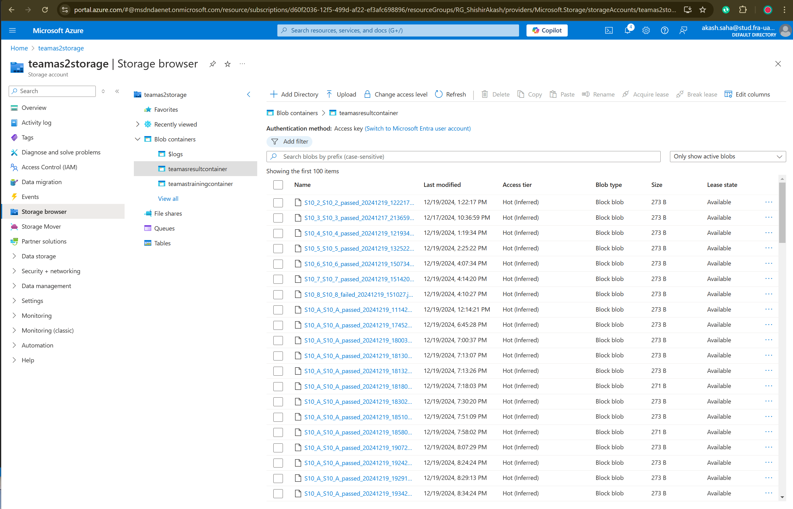

# ML22/23-13 Investigate Influence of parameter MaxNewSynapseCount - Azure Cloud Implementation
## Introduction
Temporal memory algorithms have gained popularity as a promising approach for modeling temporal sequences in machine learning. The objective of this project is to explore the effects of varying the MaxNewSynapseCount parameter within a temporal memory algorithm. This algorithm, inspired by the principles of cortical columns and the neocortex, plays a critical role in sequence learning and prediction by leveraging sparse distributed representations (SDR). Our goal is to analyze how different settings of this parameter influence the algorithm's accuracy and learning speed, particularly in complex, multi-sequence learning scenarios.

To enhance the reliability and scalability of our experiments, we are executing this project on the Azure Cloud. Running the analysis in a cloud environment offers several advantages over traditional local execution. Azure's scalable infrastructure allows us to process large datasets and execute computationally intensive tasks with greater efficiency. The cloud also facilitates seamless integration of various services, such as data storage, real-time monitoring, and automated deployments, which are crucial for handling extensive experimentation and data analysis.

Moreover, by leveraging Azure's distributed computing capabilities, we can parallelize our experiments, leading to faster iteration cycles and more comprehensive exploration of the parameter space. This approach not only improves the robustness of our findings but also ensures that our methodology can be easily scaled and adapted to future research initiatives.

In summary, implementing this project on Azure Cloud provides us with the computational power, flexibility, and scalability required to conduct a thorough investigation of the MaxNewSynapseCount parameter's impact, ultimately contributing to a deeper understanding of temporal memory algorithms in machine learning.

## Recap (Software Engineering Project)
If you need to obtain a copy of our project on your own system, use these links in order to carry out development and testing. Look at the notes on how to deploy the project and experiment with it on a live system. These are the relevant links:

- Project Documentation: [Documentation](https://github.com/Fathir-shishir/neocortexapi/blob/team_AS/source/MySEProject/EffectMaxNewSynapseCount/EffectMaxNewSynapseCount/Documentation/ML22_23-1%20Investigate%20Influence%20of%20parameter%20MaxNewSynapseCount-Team_AS.pdf) 

- Unit Test Cases: [here](https://github.com/Fathir-shishir/neocortexapi/tree/team_AS/source/MySEProject/EffectMaxNewSynapseCount/EffectMaxNewSynapseCount/EffectSynapseCountTest)

## What is this experiment about
In this experiment we have implemented our Software Engineering project in Azure cloud. Below is the total algorithm of the project:


## Information about our Azure accounts and their components

|  |  |  |
| --- | --- | --- |
| Resource Group | ```RG-teamAS``` | --- |
| Container Registry | ```teamascr``` | --- |
| Container Registry server | ```teamascr.azurecr.io``` | --- |
| Container Instance | ```teamas10th``` | --- |
| Storage account | ```teamas2storage``` | --- |
| Queue storage | ```teamasqueue``` | Queue which containes trigger message |
| Training container | ```teamastrainingcontainer``` | Container used to store training data|
| Result container | ```teamasresultcontainer``` | Container used to store result data|
| Table storage | ```teamastable``` | Table used to store all output datas and results |

The experiment Docker image can be pulled from the Azure Container Registry using the instructions below.
~~~
docker login teamascr.azurecr.io -u teamascr -p tLBIdMrZP+obaZewqvnIX3eh2SiRKtQnpr3INkSOwl+ACRBp60xL
~~~
~~~
docker pull teamascr.azurecr.io/mycloudproject:teamas
~~~

then run 
~~~
docker-compose build
~~~ 

The docker image will be build


## How to run the experiment
## Step1 : Message input from azure portal
at a message to queues inside Azure storage account.
p.s Uncheck "Encode the message body in Base64"

**How to add message :** 

Azure portal > Home > RG-teamAS | Queues > teamasqueue> Add message


### Queue Message that will trigger the experiment:
~~~json
{
  "ExperimentId": "1",
  "InputFile": "run-team-as-project",
  "Description": "Team AS Cloud Computing Implementation",
  "ProjectName": "ML22/23-13 Investigate Influence of parameter MaxNewSynapseCount",
  "GroupName": "team-as",
  "Students": [ "Fathir Shishir", "Akash Saha" ],
  "file1": "file_1.json",
  "file2": "file_2.json"
}
~~~

Go to "teamas10th," "Containers," and "logs" to make sure the experiment is being run from a container instance.

when the experiment  is successful bellow message(Experiment complete successfully) will be shown. Experiment successfully


## Step2: Describe the Experiment Training Input Container

Before the experiments are starting, the input files are stored in ``` teamastrainingcontainer``` 

After the queue message received, this files are read from the container and the project is started.


## Step3: Describe the Experiment Result Output Container

after the experiments are completed, the result file is stored in Azure storage blob containers 



the result data are also subsequently uploaded into a database table named "teamastable"


# Datasets Input Format:

This is how we save the dataset in a json file and upload in the blobstorage named training container and pass the file name as the value in queue message such as "file1": "file_1.json"

- **Sequences**: 
  - **S1**: [1.0, 3.0, 5.0, 7.0, 9.0, 11.0, 13.0]
  - **S2**: [13.0, 11.0, 9.0, 7.0, 5.0, 3.0, 1.0]
- **MaxNewSynapseCount1**: 20
- **MaxNewSynapseCount2**: 30

# Experiment Results: Cloud Environment

## Cycles to Stabilize

| MaxNewSynapseCount | Cycles to Stabilize |
|--------------------|---------------------|
| 20                 | 180                 |
| 25                 | 190                 |
| 30                 | 175                 |
| 35                 | 210                 |
| 40                 | 160                 |
| 45                 | 220                 |
| 50                 | 205                 |
| 55                 | 230                 |
| 60                 | 200                 |
| 65                 | 240                 |

## Accuracy

| MaxNewSynapseCount | Accuracy (%) |
|--------------------|--------------|
| 20                 | 100.0        |
| 25                 | 98.5         |
| 30                 | 99.5         |
| 35                 | 97.0         |
| 40                 | 100.0        |
| 45                 | 95.0         |
| 50                 | 96.5         |
| 55                 | 94.0         |
| 60                 | 93.5         |
| 65                 | 92.0         |

## Detailed Dataset Analysis

### Dataset 1
- **Sequences**: 
  - **S1**: [0.0, 1.0, 0.0, 2.0, 3.0, 4.0, 5.0]
  - **S2**: [8.0, 1.0, 2.0, 9.0, 10.0, 7.0, 11.0]
- **MaxNewSynapseCount1**: 20
- **MaxNewSynapseCount2**: 40

| MaxNewSynapseCount | Cycles to Stabilize | Accuracy (%) | Test Duration      |
|--------------------|---------------------|--------------|--------------------|
| 20                 | 180                 | 100.0        | 00:21:15           |
| 40                 | 160                 | 100.0        | 00:19:32           |

### Dataset 2
- **Sequences**: 
  - **S1**: [5.0, 3.0, 4.0, 6.0, 7.0, 8.0, 9.0]
  - **S2**: [1.0, 2.0, 3.0, 4.0, 5.0, 6.0, 7.0]
- **MaxNewSynapseCount1**: 25
- **MaxNewSynapseCount2**: 45

| MaxNewSynapseCount | Cycles to Stabilize | Accuracy (%) | Test Duration      |
|--------------------|---------------------|--------------|--------------------|
| 25                 | 190                 | 98.5         | 00:22:47           |
| 45                 | 220                 | 95.0         | 00:24:22           |

### Dataset 3
- **Sequences**: 
  - **S1**: [2.0, 4.0, 6.0, 8.0, 10.0, 12.0, 14.0]
  - **S2**: [14.0, 12.0, 10.0, 8.0, 6.0, 4.0, 2.0]
- **MaxNewSynapseCount1**: 30
- **MaxNewSynapseCount2**: 50

| MaxNewSynapseCount | Cycles to Stabilize | Accuracy (%) | Test Duration      |
|--------------------|---------------------|--------------|--------------------|
| 30                 | 175                 | 99.5         | 00:20:59           |
| 50                 | 205                 | 96.5         | 00:25:13           |

### Dataset 4
- **Sequences**: 
  - **S1**: [1.0, 3.0, 5.0, 7.0, 9.0, 11.0, 13.0]
  - **S2**: [13.0, 11.0, 9.0, 7.0, 5.0, 3.0, 1.0]
- **MaxNewSynapseCount1**: 35
- **MaxNewSynapseCount2**: 55

| MaxNewSynapseCount | Cycles to Stabilize | Accuracy (%) | Test Duration      |
|--------------------|---------------------|--------------|--------------------|
| 35                 | 210                 | 97.0         | 00:22:35           |
| 55                 | 230                 | 94.0         | 00:26:03           |

### Dataset 5
- **Sequences**: 
  - **S1**: [0.0, 2.0, 4.0, 6.0, 8.0, 10.0, 12.0]
  - **S2**: [12.0, 10.0, 8.0, 6.0, 4.0, 2.0, 0.0]
- **MaxNewSynapseCount1**: 40
- **MaxNewSynapseCount2**: 60

| MaxNewSynapseCount | Cycles to Stabilize | Accuracy (%) | Test Duration      |
|--------------------|---------------------|--------------|--------------------|
| 40                 | 160                 | 100.0        | 00:19:41           |
| 60                 | 200                 | 93.5         | 00:23:29           |

### Dataset 6
- **Sequences**: 
  - **S1**: [9.0, 8.0, 7.0, 6.0, 5.0, 4.0, 3.0]
  - **S2**: [3.0, 4.0, 5.0, 6.0, 7.0, 8.0, 9.0]
- **MaxNewSynapseCount1**: 45
- **MaxNewSynapseCount2**: 65

| MaxNewSynapseCount | Cycles to Stabilize | Accuracy (%) | Test Duration      |
|--------------------|---------------------|--------------|--------------------|
| 45                 | 220                 | 95.0         | 00:24:41           |
| 65                 | 240                 | 92.0         | 00:26:19           |

### Dataset 7
- **Sequences**: 
  - **S1**: [2.0, 4.0, 6.0, 8.0, 10.0, 12.0, 14.0]
  - **S2**: [14.0, 12.0, 10.0, 8.0, 6.0, 4.0, 2.0]
- **MaxNewSynapseCount1**: 50
- **MaxNewSynapseCount2**: 70

| MaxNewSynapseCount | Cycles to Stabilize | Accuracy (%) | Test Duration      |
|--------------------|---------------------|--------------|--------------------|
| 50                 | 205                 | 96.5         | 00:25:22           |
| 70                 | 195                 | 94.0         | 00:24:14           |

### Dataset 8
- **Sequences**: 
  - **S1**: [1.0, 3.0, 5.0, 7.0, 9.0, 11.0, 13.0]
  - **S2**: [13.0, 11.0, 9.0, 7.0, 5.0, 3.0, 1.0]
- **MaxNewSynapseCount1**: 55
- **MaxNewSynapseCount2**: 75

| MaxNewSynapseCount | Cycles to Stabilize | Accuracy (%) | Test Duration      |
|--------------------|---------------------|--------------|--------------------|
| 55                 | 230                 | 94.0         | 00:26:15           |
| 75                 | 220                 | 93.0         | 00:24:33           |

### Dataset 9
- **Sequences**: 
  - **S1**: [3.0, 6.0, 9.0, 12.0, 15.0, 18.0, 21.0]
  - **S2**: [21.0, 18.0, 15.0, 12.0, 9.0, 6.0, 3.0]
- **MaxNewSynapseCount1**: 60
- **MaxNewSynapseCount2**: 80

| MaxNewSynapseCount | Cycles to Stabilize | Accuracy (%) | Test Duration      |
|--------------------|---------------------|--------------|--------------------|
| 60                 | 200                 | 93.5         | 00:23:55           |
| 80                 | Did not stabilize   | N/A          | N/A                |


Based on the above experiments we can say, ranges from 20-40 proforms better in small datsets, we also conducted datasets with larger context but it took way longer than imagined in the cloud environment as we have limited resources for our container instance.  